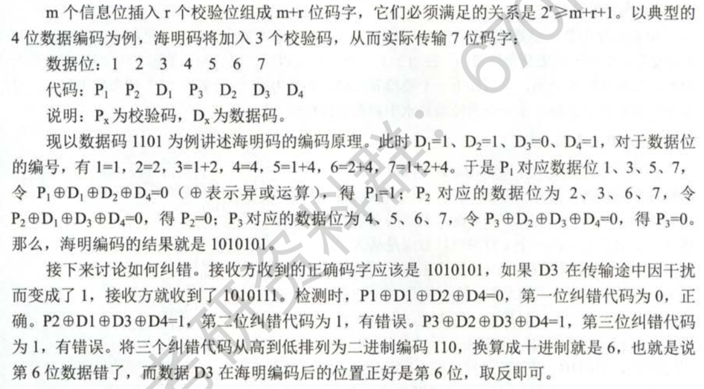

【王道 P63】

有连接就一定要有确认，即不存在无确认的面向连接的服务。

【王道 P65】

为了避免传输过程中帧的丢失，数据链路层采用的方法是**计时器超时重发**。

【王道 P66-67】

组帧

- 字符计数法
  - 帧头部使用一个计数字段来标明帧内字符数。
- 字符填充的首尾定界符法
  - 使用一些特殊字符来界定一帧的开始与结束。
- 比特填充的首尾标志法
  - 使用一个特定的比特模式，如 01111110 来标志一帧的开始和结束。
  - 发送方数据链路层在信息位中每遇到 5 个连续的 1 时，将自动在其后插入一个 0，而接收方做该过程的逆操作。
  - 比特填充很容易由硬件来实现，性能优于字符填充方法。
- 违规编码法
  - 在物理层比特编码时通常采用违规编码法，例如曼彻斯特编码方法。
  - “高-高”、“低-低”电平对在数据比特中是违规的，可以借用这些违规编码序列来界定帧的起始和终止。
  - 只适用于采用冗余编码的特殊编码环境。

由于字节计数法中计数字段的脆弱性和字符填充法实现上的复杂性与不兼容性，目前较常用的组帧方法是比特填充法和违规编码法。

【王道 P69】

检错编码

- 奇偶校验码
- 循环冗余码

【王道 P70】

纠错编码

- 海明码
  - 能发现双比特错，但只能纠正单比特错。
  - $ m $ 个信息位插入 $ r $ 个校验位组成 $ m+r $ 位码字，满足 $ 2^r \geq m + r + 1 $ 。
  - 编号为 2 的幂的位 $ (1, 2, 4, 8 ...) $ 是校验位，其余的位填入 m 位数据。
  - 

【王道 P76】

多帧滑动窗口与后退 N 帧协议（GBN）

- 后退 N 帧协议的接受窗口为 1。
- 若采用 n 个比特对帧编号，则其发送窗口的尺寸 $ W_T $ 应满足：
  - $ 1 \leq W_T \leq 2^n - 1 $ 

【王道 P77】

多帧滑动窗口与选择重传协议（SR）

- 选择重传协议的接受窗口尺寸 $ W_R $ 和发送窗口尺寸 $ W_T $ 都大于 1。
- 若采用 n 个比特对帧编号，为保证接收方向前移动窗口后，新窗口序号与旧窗口序号没有重叠部分，需要满足条件：
  -  $ W_R + W_T \leq 2^n $ 
- 由于接受窗口尺寸不应超过序号范围的一半
  - $ W_R \leq 2^{ (n - 1) } $ 
- $ W_{Tmax} = W_{Rmax} = 2^{ (n - 1) } $ 

【王道 P77】

信道的效率

- 时间角度
  - 信道效率是对发送方而言的，是指发送方在一个发送周期的时间内，有效地发送数据所需要的时间占整个发送周期的比率。

信道吞吐量

- 信道吞吐量 = 信道利用率 * 发送方的发送速率

【王道 P78】（4）

后退 N 帧协议（GBN）一般采用累积确认。

【王道 P79】（11）

对于窗口大小为 n 的滑动窗口，最多可以有 n - 1 帧已经发送但没有确认。 

