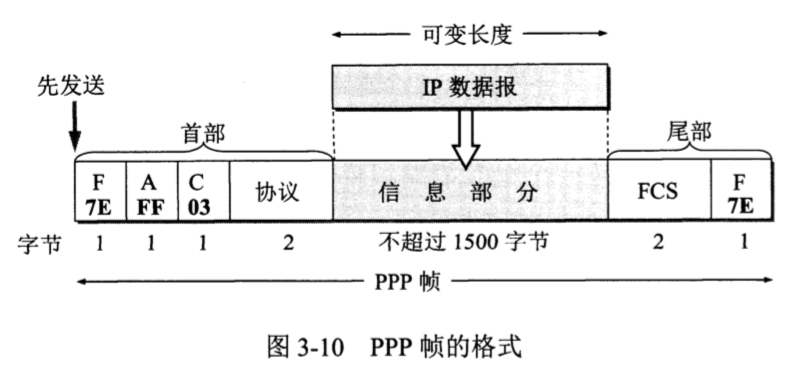
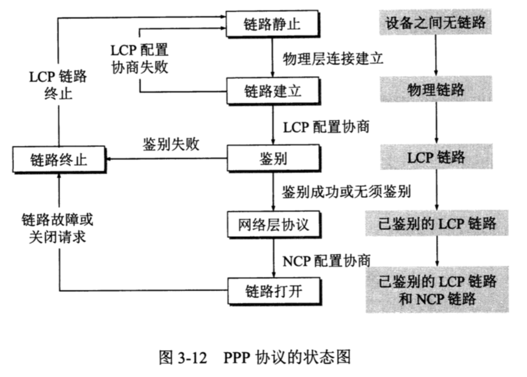
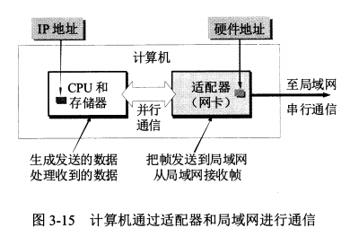

【书 P69】

从整个互联网来看，局域网仍属于数据链路层的范围。

数据链路层三个基本问题：封装成帧、透明传输和差错检测。

【书 P70】

链路 vs 数据链路

链路：从一个结点到相邻结点的的一段物理线路（有线或无线），而中间没有任何其他的交换结点。

数据链路层：除了必须有一条物理线路外，还必须有一些必要的通信协议来控制这些数据的传输。若把实现这些协议的硬件和软件加到链路上，就构成了数据链路。

【书 P72】

封装成帧：在一段数据的前后分别添加首部和尾部，这样就构成了一个帧。

- 假设
- 首部是 SOH 控制字符，作为帧开始符。SOH 十六进制编码是 01（二进制是 00000001）。
- 尾部是 EOT 控制字符，作为帧结束符。EOT 十六进制编码是 04（二进制是 00000100）。
- SOH 和 EOT 具体编码根据协议决定。

【书 P73】

透明传输

- 如果帧所携带的数据区存在与 SOH 或 EOT 相同的比特组合，就会出现帧定界错误。

- 字节填充 / 字符填充

  - 发送端的数据链路层在数据中出现控制字符 SOH 或 EOT 的前面插入一个转义字符 ESC，在 ESC 前也插入 ESC。
  - 接收端的数据链路层在把数据送往网络层之前删除这个插入的转义字符。

【书 P74】

差错检测

- 比特差错：比特在传输过程中可能会出现差错，1 可能会变成 0，0 可能会变成 1。

  - 误码率 BER：传输错误的比特占所传输比特总数的比率。

  - 循环冗余检测 CRC（Cyclic Redundancy Check）

    - 添加的冗余码称为帧检测序列 FCS（Frame Check Sequence）。
    - 只能检测出错误但并不能确定产生错误的原因。

- 传输差错

  - 帧丢失 / 帧重复 / 帧失序

- CRC + 帧编号、确认、重传机制

  - 通信质量良好的有线传输线路

    - 数据链路层协议 不使用 确认和重传机制，
    - 不要求数据链路层向上层提供可靠传输的服务，
    - 如果出现差错，那么改正差错的任务就由上层协议来完成。

  - 通信质量较差的无线传输链路

    - 数据链路层协议 使用 确认和重传机制，
    - 数据链路层向上层提供可靠传输的服务。

【书 P77】

协议标准化的一个主要目的就是提高协议的互操作性。

【书 P78】

PPP协议的帧格式

- 首部的第一个字段和尾部的第二个字段的标志字段 F（Flag），规定为 0x7E（二进制 01111110），标志字段表示一个帧的开始或结束。
- 首部中的地址字段 A 规定为 0xFF，控制字段 C 规定为 0x03。这两个字段目前实际上并没有携带 PPP 帧的信息。
- PPP 首部的第四个字段是 2 个字节的协议字段，表示信息字段所使用的网络层协议。
- 透明传输
  - 异步传输

  - - 字节填充

  - 同步传输

    - 零比特填充
      - 在发送端，先扫描整个信息字段，只要发现 5 个连续 1，则立即填入一个 0。
      - 接收端在收到一个帧时，先找到标志字段 F 以确定一个帧的边界，接着再对其中的比特流进行扫描，每当发现 5 个连续 1 时，就把这 5 个连续 1 后的 0 删除。

【书 P80】
PPP 协议的状态图

  - 
  - 从设备之间无链路开始，到先建立物理链路，再建立链路控制协议 LCP 链路。经过鉴别后再建立网络控制协议 NCP 链路，然后才能交换数据。
  - PPP 协议已不是纯粹的数据链路层的协议，还包括了物理层和网络层的内容。

【书 P83】

局域网工作的层次跨越了数据链路层和物理层。

【书 P85】

计算机的硬件地址就在适配器的 ROM 中，而计算机的软件地址（IP 地址）则在计算机的存储器中。

【书 P86】

- CSMA/CD：载波监听多点接入/碰撞检测（Carrier Sense Multiple Access with Collision Detection）
  - 载波监听
    - 检测信道
    - 不管在发送前，还是发送中，每个站都必须不停地检测信道。
  - 碰撞检测
    - 边发送边监听。
- 以太网发送的数据都是用**曼彻斯特编码**的信息。
- **电磁波在 1 km 电缆的传播时延约为 5 微秒**。
- 在使用 CSMA/CD 协议时，一个站**不可能同时进行发送和接收（但必须边发送边监听信道）**。因此使用 CSMA/CD 协议的以太网不可能进行全双工通信而只能进行**双向交替通信（半双工通信）**。
- 争用期
  - 以太网端到端往返时间 2 倍。

