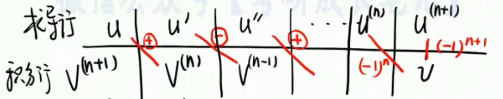

## 一、定义
1. 不定积分**【 +C 】** 
  - $ \forall x \in I $ ，使 $ F'(x) = f(x) $ ，则称 $ F(x) $ 是 $ f(x) $ 在 $ I $ 上的一个原函数。
  - 全体原函数就叫不定积分，记成：$ \int f(x) {\rm d}x  = F(x) + C $ 。
2. 定积分
  - 黎曼积分 
  - $ \int_a^b f(x) {\rm d}x $ 
3. 小结
  - 牛顿—莱布尼茨公式
    - $ \int_a^b f(x) {\rm d}x = \left. F(x) \right|_{x = a}^{x = b} = F(b) - F(a) $

 
## 二、计算
 
#### ㊀、凑微分法
1. 基本积分公式
  - $ \int x^k {\rm d}x = \dfrac{1}{k + 1}x^{k + 1} + C, \quad ( k \not= -1 ) $ 
    - $ \begin{cases} \int \dfrac{1}{x^2} {\rm d}x = -\dfrac{1}{x} + C \\[1em] \int \dfrac{1}{ \sqrt{x} } {\rm d}x = 2 \sqrt{x} + C \end{cases} $ 
      - $ {\rm d} \int \dfrac{1}{ \sqrt{x} } {\rm d}x = {\rm d} ( 2 \sqrt{x} + C ) \implies \dfrac{1}{ \sqrt{x} } {\rm d}x = {\rm d}( 2 \sqrt{x} ) \implies \dfrac{ {\rm d}u }{ \sqrt{u} } = {\rm d}( 2 \sqrt{u} ) $ 
  - $ \int \dfrac{1}{x} {\rm d} = \ln |x| + C $ 
  - $ \begin{cases} \int a^x {\rm d}x = \dfrac{1}{ \ln a } a^x + C, \quad ( a > 0, a \not= 1 ) \\[1em] \int e^x {\rm d}x = e^x + C \end{cases} $ 
  - $ \begin{cases} \begin{cases} \int \sin x {\rm d}x = - \cos x + C \\[1em] \int \cos x {\rm d}x = \sin x + C \\[1em] \int \tan x{\rm d}x = - \ln | \cos x | + C \\[1em] \int \cot x {\rm d}x = \ln | \sin x | + C \end{cases}  \\[1em] \begin{cases} \int \sec x {\rm d}x = \ln | \sec x + \tan x | + C \\[1em] \int \csc x {\rm d}x = \ln | \csc x - \cot x | + C \\[1em] \int \sec^2 x {\rm d}x = \tan x + C \\[1em] \int \csc^2 x {\rm d}x = - \cot x + C \end{cases} \\[1em] \begin{cases} \int \sec x \tan x {\rm d}x = \sec x + C \\[1em] \int \csc x \cot x {\rm d}x = - \csc x + C \end{cases}  \end{cases} $ 
  - $ \begin{cases} \begin{cases} \int \dfrac{1}{ \sqrt{1 - x^2} }{\rm d}x = \arcsin x + C \\[1em] \int \dfrac{1}{ \sqrt{a^2 - x^2} }{\rm d}x = \arcsin \dfrac{x}{a} + C \end{cases} \\[1em] \begin{cases} \int \dfrac{1}{1 + x^2}{\rm d}x = \arctan x + C \\[1em] \int \dfrac{1}{a^2 + x^2}{\rm d}x = \dfrac{1}{a} \arctan \dfrac{x}{a} + C \end{cases} \\[1em] \begin{cases} \int \dfrac{1}{ \sqrt{x^2 + a^2} } = \ln ( x + \sqrt{x^2 + a^2} ) + C \\[1em] \int \dfrac{1}{ \sqrt{x^2 - a^2} } = \ln ( x + \sqrt{x^2 - a^2} ) + C \end{cases} \\[1em] \begin{cases} \int \dfrac{1}{a^2 - x^2} {\rm d}x = \dfrac{1}{2a} \ln |\dfrac{a + x}{a - x}| + C \\[1em] \int \dfrac{1}{x^2 - a^2} {\rm d}x = \dfrac{1}{2a} \ln |\dfrac{x - a}{x + a}| + C \end{cases} \\[1em] \int \sqrt{a^2 - x^2} {\rm d}x = \dfrac{a^2}{2} \arcsin \dfrac{x}{a} + \dfrac{x}{2} \sqrt{a^2 - x^2} + C \end{cases} $ 
2. 例题
   1. $ \int \dfrac{1}{ (2 - x) \sqrt{1 - x} } {\rm d}x $ 
     - $ = - \int \dfrac{1}{2 - x} \cdot \dfrac{ {\rm d}(1 - x) }{ \sqrt{1 - x} } = -2 \int \dfrac{ {\rm d} \sqrt{1 - x} }{ 2 - x } $ 
     - $ = -2 \int \dfrac{ {\rm d} \sqrt{1 - x} }{ 1 + ( \sqrt{1 - x} )^2 } = -2 \arctan \sqrt{1 - x} + C $ 
   2. $ \int \dfrac{x}{ (2 - x^2) \sqrt{1 - x^2} } {\rm d}x ​$ 
   3. $ \int \dfrac{ \cos^2 x - \sin x }{ \cos x(1 + \cos x e^{\sin x}) } {\rm d}x $ 
      - **定理** 
        - 对于 $ \int f(x) {\rm d}x $ ，$ f(x) $ 越复杂 $ \implies $ 越有规律可循。
        1. 先对**复杂的主要部分( h(x) )**求导
          - $ \int f(x) {\rm d}x = \int g(x) \cdot h(x) {\rm d}x $ 
            - 其中，若 $ h'(x) = A \cdot g(x) \implies {\rm d} h(x) = A \cdot g(x) {\rm d}x $ 
        2. 凑微分 
           - $ \int f(x) {\rm d}x = \dfrac{1}{A} \int h(x) \cdot A \cdot g(x) {\rm d}x = \dfrac{1}{A} \int h(x) {\rm d} h(x) $ 
      - 解答
        1. $ (\cos x e^{\sin x})' = - \sin x e^{\sin x} + \cos^2 x e^{\sin x} = e^{\sin x}( \cos^2 x - \sin x ) $ 
           - $ \begin{array}{l} I & = \int \dfrac{ e^{\sin x}( \cos^2 x - \sin x ) {\rm d}x }{ e^{\sin x} \cos x( 1 + \cos x e^{\sin x} ) } \\[1em] & = \int \dfrac{ {\rm d}( \cos x e^{\sin x} ) }{ \cos x e^{\sin x}( 1 + \cos x e^{\sin x} ) } \quad \quad ( \dfrac{ {\rm d}u }{ u(1 + u) } ) \\[1em] & = \ln | \dfrac{ \cos x e^{\sin x} }{ 1 + \cos x e^{\sin x} } | + C \end{array} $ 
   4. 求 $ \int \dfrac{1 - \ln x}{ (x - \ln x)^2 } {\rm d}x $ 
     - 分析
       - $ ( \dfrac{x - \ln x}{x} )' = - \dfrac{1 - \ln x}{x^2} $ 
     - 解答
       - $ \begin{array}{l} I = \int \dfrac{ \dfrac{1 - \ln x}{x^2} }{ ( \dfrac{x - \ln x}{x} )^2 } {\rm d}x = - \int \dfrac{ {\rm d} \dfrac{x - \ln x}{x} }{ ( \dfrac{x - \ln x}{x} )^2 } = \dfrac{x}{x - \ln x} + C \end{array} ​$ 

 
#### ㊁、换元法
当凑微分法不成功时，考虑换元。
1. 三角换元
   - 方法
     - 当被积函数 $ f(x) $ 含有 $ \sqrt{a^2 - x^2} $ ，$ \sqrt{a^2 + x^2} $ ，$ \sqrt{x^2 - a^2} \quad (a > 0)$ 可作如下换元：
     - $ \sqrt{a^2 - x^2} \implies $ 令 $ x = a \sin t, \quad ( -\dfrac{\pi}{2} < t < \dfrac{\pi}{2} ) $ 
       - 单调函数 有 反函数（保单调，可回代）
     - $ \sqrt{a^2 + x^2} \implies $ 令 $ x = a \tan t, \quad ( -\dfrac{\pi}{2} < t < \dfrac{\pi}{2} ) $ 
     - $ \sqrt{x^2 - a^2} \implies $ 令 $ x = a \sec t, \quad \begin{cases} x > 0,  0 \leq t < \dfrac{\pi}{2} \\[1em] x < 0, \dfrac{\pi}{2} < t \leq \pi \end{cases} $ 
     - 若见到 $ \sqrt{ax^2 + bx + c} $ ，要先化为 $ \sqrt{ \varphi^2(x) - k^2 } $ ，$ \sqrt{ k^2 - \varphi^2(x) } $ ，$ \sqrt{ \varphi^2(x) + k^2 } $ ，再做三角换元。
   - 例题
     1. 求 $ \int \dfrac{ {\rm d}x }{x + \sqrt{1 - x^2}} $ 
        - 令 $ x = \sin t, t \in ( \dfrac{\pi}{2}, \dfrac{\pi}{2} ) $ 
        - $ I = \dfrac{ \cos t }{ \sin t + \cos t } {\rm d}t = \dfrac{1}{2} \int \dfrac{ \sin t + \cos t + \cos t - \sin t }{ \sin t + \cos t } {\rm d}t $ 
        - $ I = \dfrac{1}{2} ( \int 1 {\rm d}t + \int \dfrac{ {\rm d} ( \sin t + \cos t ) }{ \sin t + \cos t } ) = \dfrac{1}{2} ( t + \ln | \sin t + \cos t | ) $ 
        - $ I = \dfrac{1}{2} \arcsin x + \dfrac{1}{2} \ln | x + \sqrt{1 - x^2} | + C $ 
        - ⭐️【注】⭐️
          - $ \begin{array}{l} \int \dfrac{ a_2 \sin t + b_2 \cos t }{ a_1 \sin t + b_1 \cos t } {\rm d}t & = \int \dfrac{ A ( a_1 \sin t + b_1 \cos t ) + B ( a_1 \cos t - b_1 \sin t ) }{ a_1 \sin t + b_1 \cos t } {\rm d}t \\[1em] & = At + B \ln| a_1 \sin t + b_1 \cos t | + C  \end{array} $ 
          - 其中 $ \begin{cases} Aa_1 - Bb_1 = a_2 \\[1em] Ab_1 + Ba_1 = b_2 \end{cases} $ 
2. 倒带换 $ (x = \dfrac{1}{t}) $ 
   - 可用于分子次数明显低于分母次数时。
   - 方法
     - $ \left. \begin{array}{l} \int \dfrac{1}{ x^k \sqrt{ a^2 - x^2 } } {\rm d}x \\[1em] \int \dfrac{1}{ x^k \sqrt{ a^2 + x^2 } } {\rm d}x \\[1em] \int \dfrac{1}{ x^k \sqrt{ x^2 - a^2 } } {\rm d}x \end{array} \right\} \quad k = 1, 2, 4 $ 
3. 复杂部分代换
   - **令复杂部分 $ = t $ **（举重若轻）
   - 方法
     - $ \sqrt[n]{ax + b} = t $ ， $ \sqrt{ \dfrac{ax + b}{cx + d} } = t $ ， $ \sqrt{ ae^{bx} + c } = t $ （根式代换）
     - $ a^x, e^x = t $ （指数代换）
     - $ \ln x = t $ （对数代换）
     - $ \arcsin x, \arctan x = t $ （反三角函数代换）$ ... $ 
   - 例题
     1. 求 $ I = \int \sqrt{ \dfrac{1 - x}{1 + x} } \cdot \dfrac{ {\rm d}x }{x} $ 。
       - 解1⃣️
         - 令 $ \sqrt{ \dfrac{1 - x}{1 + x} } = t, \quad x = \dfrac{1 - t^2}{1 + t^2} $ 
         - 所以： $ \begin{array}{l} I & = \int t \cdot \dfrac{1 + t^2}{1 - t^2} \cdot \dfrac{-4t}{ (1 + t^2)^2 } {\rm d}t \\[1em] & = -4 \int \dfrac{t^2}{ (1 - t^2)(1 + t^2) } {\rm d}t \\[1em] & = 2 \int ( \dfrac{1}{1 + t^2} - \dfrac{1}{1 - t^2} ) {\rm d}t \\[1em] & = 2 \arctan t - \ln| \dfrac{1 + t}{1 - t} | + C \end{array} $
         - **回代**：$ I = 2 \arctan \sqrt{ \dfrac{1 - x}{1 + x} } - \ln | \dfrac{ \sqrt{1 + x} - \sqrt{1 - x} }{ \sqrt{1 + x} - \sqrt{1 - x} } | + C $ 
       - 解2⃣️
         - $ I = \int \sqrt{ \dfrac{1 - x}{1 + x} } \cdot \dfrac{ {\rm d}x }{x} = \int \dfrac{ \sqrt{1 - x^2} }{(1 + x)x} {\rm d}x $ 
         - 令 $ s = \sin t, t \in ( -\dfrac{\pi}{2}, \dfrac{\pi}{2} ) $ 
         - $ \begin{array}{l} I & = \int \dfrac{ \cos^2 t }{ (1 + \sin t) \sin t } {\rm d}t \\[1em] & = \int \dfrac{ (1 + \sin t)(1 - \sin t) }{ (1 + \sin t) \sin t } {\rm d}t \\[1em] & = \int \csc t {\rm d}t - \int 1 {\rm d}t \\[1em] & = \ln| \csc t - \cot t | - t + C \end{array} $ 
         - 回代：$ I = \ln| \dfrac{1}{x} - \dfrac{ \sqrt{1 - x^2} }{x} | - \arcsin x + C $ 

 
#### ㊂、分部积分法

$ \underrightarrow{ \text{反、对、幂、指、三} } \implies \underrightarrow{ \text{更容易求导} \to \text{更容易积分} } \implies \int u {\rm d}v = uv - \int v {\rm d}u $  

此方法一般是在运算过程中：$ \begin{cases} 1. \text{出现了不同类型函数的乘积} \\[1em] 2. \text{且求} \int u {\rm d}v \text{ 困难}，而求 \int v {\rm d}u \text{ 简单时} \end{cases} $ 

1. ⭐️方法
  1. 被积函数为 $ P_n(x) \cdot e^{kx} $ ，$ P_n(x) \sin ax $ ，$ P_n(x) \cos ax $ ，选 $ P_n(x) = u $ ，其中 $ P_n(x) $ 为幂函数多项式。
    - $ u $ 求导至 $ 0 $ 。
  2. 被积函数为 $ e^{ax} \sin bx $ ，$ e^{ax} \cos bx $ ，选谁当 $ u $ 都行。
    - $ u $ 求导两次。 
  3. 被积函数为 $ P_n(x) \ln x $ ，$ P_n(x) \arcsin x $ ，$ P_n(x) \arctan x $ ，选 $ \ln x， \text{arc-} = t $ 。
    - $ u $ 求导一次。 
  - 【注】分部积分公式的推广为：
    - $ \int uv^{(n + 1)} {\rm d}x = uv^{(n)} - u'v^{(n - 1)} + u''v^{(n - 2)} - ... + (-1)^n u^{(n)}v + (-1)^{n + 1} \int u^{(n + 1)}v {\rm d}x $ 

    - | $ u $ | $ u' $ | $ u'' $ | $ ... $ | $ u^{(n)} $ | $ u^{(n + 1)} $ |
      | :----: | :----: | :-----: | :-----: | :---------: | :-------------: |
      | $ v^{(n + 1)} $ | $ v^{(n)} $ | $ v^{(n - 1)} $ | $ ... $ | ... | $ v $ |

    - 对 $ u $ 求导，对 $ v^{(n + 1)} $ 积分
    - 交错相乘、正负相间、首项为正
    - 最后一项（列）相乘再积分
    - 
2. 例题  
   1. 求 $ \int x^2 \arctan x {\rm d}x $ 
     - $ = \dfrac{1}{2} x^2 - \dfrac{1}{2} \ln (1 + x^2) + C $ 
   2. 求 $ \int e^{2x} \sin 3x {\rm d}x $ 
     - $ = -\dfrac{3}{13} e^{2x} \cos 3x + \dfrac{2}{13} e^{2x} \sin 3x + C $ 
   3. 设 $ f( \ln x ) = \dfrac{ \ln (1 + x) }{x} $ ，计算 $ \int f(x) {\rm d}x $ 。
     - 令 $ \ln x = t, \quad t = e^t \implies f(t) = \dfrac{ \ln(1 + e^t) }{e^t} $ 
     - $ \begin{array}{l} \int f(x) {\rm d}x & = \int \ln (1 + e^x) \cdot e^{-x} {\rm d}x \\[1em] & = - e^{-x} \ln(1 + e^x) + \int \dfrac{1 + e^x - e^x}{1 + e^x} {\rm d}x \\[1em] & = - e^{-x} \ln(1 + e^x) + x - \ln(1 + e^x) + C \\[1em] & = x - ( e^{-x} + 1 )\ln (1 + e^x) + C \end{array} $ 

 
#### ㊃、有理函数积分
1. 定义
  - 形如 $ \int \dfrac{ P_n(x) }{ Q_m(x) } {\rm d}x, \quad (n < m) $ 的积分。 
2. 方法
  1. 将 $ Q_m(x) $ 因式分解
  2. 将 $ \dfrac{ P_n(x) }{ Q_m(x) } $ 拆成若干最简有理公式之和
3. 拆分原则
  1. $ Q_m(x) $ 分解出 $ (ax + b)^k \implies $ 产生 $ k $ 项。
    - $ \dfrac{A_1}{ ax + b } + \dfrac{A_2}{ (ax + b)^2 } + ... + \dfrac{A_k}{ (ax + b)^k }, \quad k = 1, 2, ... $ 
  2. $ Q_m(x) $ 分解出 $ (px^2 + qx + r)^k \implies $ 产生 $ k $ 项。
    - $ \dfrac{ A_1x + B_1 }{ px^2 + qx +r } + \dfrac{ A_2x + B }{ (px^2 + qx + r)^2 } + ... + \dfrac{ A_kx + B_k }{ (px^2 + qx + r)^k }, \quad k = 1, 2, ... $ 
4. 例题
  1. 计算 $ I = \int \dfrac{ 4x^2 - 6x -1 }{ (x + 1)(2x - 1)^2 } {\rm d}x $ 。
    - $ \dfrac{ 4x^2 - 6x -1 }{ (x + 1)(2x - 1)^2 } = \dfrac{1}{x + 1} - \dfrac{2}{ (2x - 1)^2 } $ 
      - $ 4x^2 - 6x -1 = A(2x - 1)^2 + B(x - 1)(2x - 1) + C(x + 1) $ 
        - $ \begin{cases} \text{取} x = \dfrac{1}{2}, \quad -3 = C( \dfrac{1}{2} + 1 ) & \implies C = -2 \\[1em] \text{取} x = -1, \quad 9 = 9A & \implies A = 1 \\[1em] \text{比较} x^2 \text{的系数}, \quad 4 = 4A + 2B & \implies B = 0 \end{cases} $
    - $ I = \int \dfrac{1}{x + 1} {\rm d}x - 2 \int \dfrac{1}{ (2x - 1)^2 } {\rm d}x = \ln |x + 1| + \dfrac{1}{2x - 1} + C $ 
  2. 计算 $ I = \int \dfrac{x}{x^3 - x^2 + x - 1} {\rm d}x $ 
    - $ I = I = \int \dfrac{x}{ (x^2 + 1)(x - 1) } {\rm d}x $ 
    - $ \dfrac{x}{ (x^2 + 1)(x - 1) } = \dfrac{1}{2} ( \dfrac{-x + 1}{x^2 + 1} + \dfrac{1}{x - 1} ) $ 
    - $ \begin{array}{l} I & = -\dfrac{1}{2} \int ( \dfrac{ \dfrac{1}{2} \cdot 2x - 1 }{ x^2 + 1 } ) {\rm d}x -\dfrac{1}{2} \int \dfrac{1}{x - 1} {\rm d}x \\[1em] & = -\dfrac{1}{4} \ln(x^2 + 1) + \dfrac{1}{2} \arctan x + \dfrac{1}{2} \ln |x - 1| + C \end{array} $ 
  3. 计算 $ I = \int \dfrac{t^3 - 3t}{ (t - 1)^2(t + 1)^2 } {\rm d}t $
     - $ \dfrac{t^3 - 3t}{ (t - 1)^2(t + 1)^2 } = \dfrac{ \dfrac{1}{2} }{t - 1} + \dfrac{ -\dfrac{1}{2} }{ (t - 1)^2 } + \dfrac{ \dfrac{1}{2} }{t + 1} + \dfrac{ \dfrac{1}{2} }{ (t + 1)^2 } $ 
     - $ \begin{array}{l} I & = \dfrac{1}{2} ( \ln |t - 1| + \dfrac{1}{t - 1} + \ln |t + 1| - \dfrac{1}{t + 1} ) + C \\[1em] & = \dfrac{1}{2} \ln |t^2 - 1| + \dfrac{1}{t^2 - 1} + C \end{array} $ 

 

## 定积分的计算
1. 方法
  - $ \int_a^b f(x) {\rm d}x = F(b) - F(a) $ 
    - 若 $ a $ 或 $ b $ 不存在，则计算其极限。 
2. 例题
  1. $ I =  \int_1^4 \dfrac{1}{ 1 + \sqrt{x} } {\rm d}x $ 

    - $ I = 2( 1 - \ln 3 + \ln 2 ) $ 
  2. ⭐️ $ I_n = \int_0^{ \frac{\pi}{2} } \sin^n x {\rm d}x $ ，$ n $ 为大于 $ 1 $ 的整数。
    - 正弦曲线一股的面积是 $ 2 $，半股的面积是 $ 1 $。

      - $ \int_0^{ \frac{\pi}{2} } \sin x {\rm d}x = 1 $ 

    - 证 $ \int_0^{ \frac{\pi}{2} } \sin^n x {\rm d}x = \int_0^{ \frac{\pi}{2} } \cos^n x {\rm d}x $ 。
      - 令 $ x = \dfrac{\pi}{2} - t $ 
      - $ \int_0^{ \frac{\pi}{2} } \sin^n x {\rm d}x = \int_{ \frac{\pi}{2} }^0 \sin^n (\dfrac{\pi}{2} - t) {\rm d}(-t) = \int_0^{ \frac{\pi}{2} } \cos^n x {\rm d}x $ 
    - 方法
      - $ n > 1 $ 时
        - $ \begin{array}{l} I_n & = \int_0^{ \frac{\pi}{2} } \sin^{n - 1} x \cdot \sin x {\rm d}x = - \int_0^{ \frac{\pi}{2} } \sin^{n - 1} x {\rm d} \cos x \\[1em] & = \left. - \sin^{n - 1} x \cos x \right|_0^{ \frac{\pi}{2} } + \int_0^{ \frac{\pi}{2} } \cos x \cdot (n - 1) \cdot \sin^{n - 2}x \cdot \cos x {\rm d}x \\[1em] & = (n - 1) \int_0^{ \frac{\pi}{2} } (1 - \sin^2 x) \sin^{n - 2} x {\rm d}x \\[1em] & = (n - 1) \int_0^{ \frac{\pi}{2} } \sin^{n - 2} x {\rm d}x - (n - 1) \int_0^{ \frac{\pi}{2} } \sin^n x {\rm d}x \\[1em] & = (n - 1) I_{n - 2} - (n - 1) I_n \end{array} $ 
        - $ \implies I_n = \dfrac{n - 1}{n} I_{n - 2}, \quad n = 2, 3, ... $ 
        - ⭐️ $ I_n = \begin{cases} \dfrac{n - 1}{n} \cdot \dfrac{n - 2}{n - 3} ... \dfrac{1}{2} \cdot \dfrac{\pi}{2}, \quad & n \text{ 为正偶数} \\[1em] \dfrac{n - 1}{n} \cdot \dfrac{n - 2}{n - 3} ... \dfrac{2}{3} \cdot 1, \quad & n \text{ 为大于1的奇数} \end{cases} $ 
          - 华里士公式
  3. $ I = \int_{-1}^1 x^2 \sqrt{1 - x^2} {\rm d}x $ 
    - $ I = 2 \int_0^1 x^2 \sqrt{1 - x^2} {\rm d}x $ 
    - 令 $ x = \sin t $ 
      - $ \begin{array}{l} I & = 2 \int_0^{ \frac{\pi}{2} } \sin^2 t \cos^2 t {\rm d}t \\[1em] & = 2 \int_0^{ \frac{\pi}{2} } \sin^2 t {\rm d}t - 2 \int_0^{ \frac{\pi}{2} } \sin^4 t {\rm d}t \\[1em] & = 2 \cdot \dfrac{1}{2} \cdot \dfrac{\pi}{2} - 2 \cdot \dfrac{3}{4} \cdot \dfrac{1}{2} \cdot \dfrac{\pi}{2} \\[1em] & = \dfrac{\pi}{8} \end{array} $ 
  4. 求 $ I = \int_0^{2 \pi} \sin^n x {\rm d}x, \quad (n > 1) $ 
    - 预备定理
      - 若 $ f(x) $ 以 $ T $ 为周期，连续，则 
        - $ \forall a $ ， $ \int_0^T f(x) {\rm d}x = \int_a^{a + T} f(x) {\rm d}x $ 
      - 证明
        - $ \int_a^{a + T} f(x) {\rm d}x = \int_a^0 f(x) {\rm d}x + \int_0^T f(x) {\rm d}x + \int_T^{a + T} f(x) {\rm d}x $ 
        - 令 $ x - T = u $ ，$ \int_a^{a + T} f(x) {\rm d}x = \int_0^a f(u + T) {\rm d}u = \int_0^a f(u) {\rm d}u = - \int_a^0 f(x) {\rm d}x $ 
        - 所以 $ \int_0^T f(x) {\rm d}x = \int_a^{a + T} f(x) {\rm d}x $ 。
      - 延伸
        - $ f(x) $ 是奇函数，$ T $ 为周期，连续，则：
        - $ \int_0^T f(x) {\rm d}x = \int_{ -\frac{\pi}{2} }^{ \frac{\pi}{2} } f(x) {\rm d}x = 0 $ 
    - 计算
      - $ I = \int_{-\pi}^{\pi} \sin^n x {\rm d}x = \begin{cases} 0, & n \text{ 为奇数} \\[1em] 2 \int_0^{\pi} \sin^n x {\rm d}x, & n 为偶数 \end{cases} $ 
      - 其中 $ \int_0^{\pi} \sin^n x {\rm d}x = \int_0^{ \frac{\pi}{2} } \sin^n x {\rm d}x + \int_{ \frac{\pi}{2} }^{\pi} \sin^n x {\rm d}x $ 
        - 令 $ t = {\pi} - x $ ，$ \int_{ \frac{\pi}{2} }^{\pi} \sin^n x {\rm d}x = \int_{ \frac{\pi}{2} }^0 \sin^n ( {\pi} - t )( - {\rm d}t ) = \int_0^{ \frac{\pi}{2} } \sin^n t {\rm d}t $ 
      - ⭐️ $ \int_{0}^{2 \pi} \cos^n x {\rm d}x = \int_{0}^{2 \pi} \sin^n x {\rm d}x = \begin{cases} 0, & n \text{ 为奇数} \\[1em] 4 \int_0^{ \frac{\pi}{2} } \sin^n x {\rm d}x, & n 为偶数 \end{cases} $ 
    5. 计算 $ \int_0^6 x^2 \sqrt{6x - x^2} {\rm d}x $ 。
       - 令 $ x = 3 + 3 \sin t $ 

