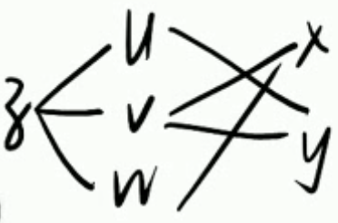
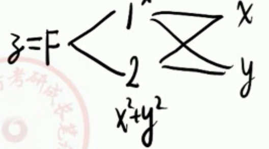

## 一、概念

 
####  ㊀、极限
1. 概念
  - 设 $ f(x, y) $ 的定义域为 $ D $ ，$ P_0(x_0, y_0) $ 是 $ D $ 的聚点。
  - $ \forall \varepsilon > 0 $ ， $ \exists \delta > 0 $ , 当 $ P(x, y) \in D \bigcap \bigcup\limits^o ( P_0, \delta ) $ 时，恒有 $ | f(x, y) - A | < \varepsilon \implies \lim\limits_{x \to x_0 \atop y \to y_0} f(x, y) = A $ 。
2. 例题
  1. 求 $ I = \lim\limits_{x \to 0 \atop y \to 0} \dfrac{ \sqrt{xy + 1} - 1 }{xy} ​$ 。
    - 其他教材（ $ P(x, y) \in \bigcup\limits^o ( P_0, \delta ) $ ）
      - $ x = 0 / y = 0 $ 时，极限不存在
      - 所以极限不存在
    - 同济七版教材（考研参考教材）
      - $ I = \lim\limits_{x \to 0 \atop y \to 0} \dfrac{xy}{ xy ( \sqrt{xy + 1} + 1 ) } = \dfrac{1}{2} $ 。

 
#### ㊁、连续性
1. 概念
  - 若 $ \lim\limits_{x \to x_0 \atop y \to y_0} f(x, y) = f(x_0, y_0) $ ，则称 $ f(x, y) $ 在 $ (x_0, y_0) $ 处连续。
  - 【注】
    - 若 $ \lim\limits_{x \to x_0 \atop y \to y_0} f(x, y) \not= f(x_0, y_0) $ ，叫不连续，不讨论间断类型。

 
#### ㊂、偏导数（必考）
1. 概念
  - $ z = f(x, y) $
  - $ \left. \dfrac{ \partial f }{ \partial x } \right|_{ (x_0, y_0) } = f'_x(x_0, y_0) = \lim\limits_{ \Delta x \to 0 } \dfrac{ f(x_0 + \Delta x, y_0) - f(x_0, y_0) }{\Delta x} $ 。 
2. 例题
  1. 设 $ f(x, y) = e^{ \sqrt{ x^2 + y^6 } } $ ，求 $ f'_x(0, 0) $ ， $ f'_y(0, 0) $ 。
    - ⭐️ 见到 $ f'_x(x_0, y_0), f'_y(x_0, y_0) \implies $ 先写定义再说。
    - $ f'_x(0, 0) = \lim\limits_{\Delta x \to 0} \dfrac{ f(0 + \Delta x, 0) - f(0, 0) }{\Delta x} = \lim\limits_{\Delta x \to 0} \dfrac{ e^{ |\Delta x| } - 1 }{\Delta x} = \lim\limits_{\Delta x \to 0} \dfrac{ |\Delta x| }{\Delta x} $ 
    - $ \implies f'_x(0, 0) $ 不存在
    - $ f'_y(0, 0) = \lim\limits_{\Delta y \to 0} \dfrac{ f(0, 0 + \Delta y) - f(0, 0) }{\Delta y} = \lim\limits_{\Delta y \to 0} \dfrac{ e^{ |\Delta y|^3 } - 1 }{\Delta y} = \lim\limits_{\Delta y \to 0} \dfrac{ |\Delta y|^3 }{\Delta y} = 0 $ 
  2. 设 $ f(x, y) = \begin{cases} \dfrac{1}{xy} \sin (x^2 y), & xy \not= 0 \\[1em] 0, & xy = 0 \end{cases} $ ，则 $ f'_x(0, 1) =  $ \_\_\_\_\_\_\_\_ 。
     - $ f'_x(0, 1) = \lim\limits_{\Delta x \to 0} \dfrac{ f(0 + \Delta x, 1) - f(0, 1) }{\Delta x} = \lim\limits_{\Delta x \to 0} \dfrac{ \dfrac{1}{\Delta x} \sin( (\Delta x)^2 ) - 0 }{\Delta x} = 1 $ 

 
## 二、计算（必考）——多元函数微分学

 
#### ㊀、链式求导规则
1. 概念
  - 设 $ z = f(u, v, w), u = u(y), v = v(x, y), w = w(x) $ 。
  - 
  - 称 $ x, y $ 叫自变量，$ u, v, w $ 叫中间变量，$ z $ 叫因变量。
  - $ \dfrac{ \partial z }{ \partial x } = \dfrac{ \partial z }{ \partial v } \dfrac{ \partial v }{ \partial x } + \dfrac{ \partial z }{ \partial w } \dfrac{ {\rm d}w }{ {\rm d}x } \quad ( \text{ 分叉写 } \partial，\text{ 不分叉写 } {\rm d} ) $ 

 
#### ㊁、高阶偏导数
1. 【注】
  - 不论 $ z $ 对谁求导，也不论 $ z $ 已经求了几阶导，求导之后的新函数仍与 $ z $ 有相同的复合结构。
2. 例题
  1. 设 $ F(u, v) $ 对其变元 $ u, v $ 具有二阶连续偏导数，并设 $ z = F( \dfrac{y}{x}, x^2 + y^2) $ ，则 $ \dfrac{ \partial^2 z }{ \partial x \partial y } = $ \_\_\_\_\_\_\_\_ 。
    - 
    - $ \dfrac{ \partial z }{ \partial x } = F'_1 \cdot ( - \dfrac{y}{x^2} ) + F'_2 \cdot 2x $ 
    - $ \dfrac{ \partial^2 z }{ \partial x \partial y } = \dfrac{ \partial ( \dfrac{ \partial z }{ \partial x } ) }{\partial y} = - \dfrac{1}{x^2} F'_1 - \dfrac{y}{x^3} F''_{11} + (2 - \dfrac{2y^2}{x^2} ) F''_{12} + 4xy F''_{22} $
  2. 设 $ f(u, v) $ 二阶偏导数连续，$ z = f(x^2y, \cos x \sin y) $ ，求 $ \dfrac{ \partial^2 z }{ \partial x \partial y } $ 。
    - $ 2xf'_1 - \sin x \cos y f'_2 + 2 x^3 y f''_{11} + (2xy \cos x \cos y - x^2 \sin x \sin y)f''_{12} - \sin x \cos x \sin y \ cos y f''_{22} ​$ 

 
#### ㊂、

