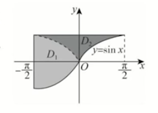
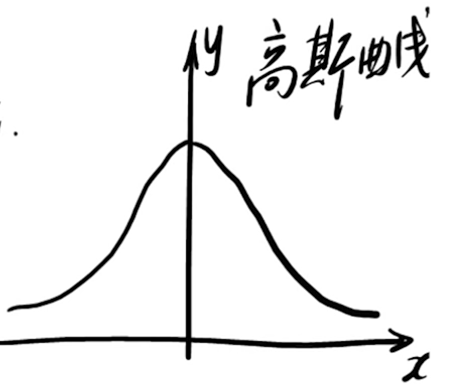

## 一、对称性

 
####  ㊀ 、普通对称性

1. 概念
  - 若区域 $ D $ 关于 $ y $ 轴对称
    - $ \begin{cases} \iint\limits_D f(x, y) {\rm d} \sigma = 2 \iint\limits_{D_1} f(x, y) {\rm d} \sigma, & f(x, y) = f(-x, y) \\[1em] \iint\limits_D f(x, y) {\rm d} \sigma = 0, & f(x, y) = -f(-x, y) \end{cases} $ 
2. 例题
  1. 设平面区域 $ D $ 由曲线 $ y = \sin x ( -\dfrac{\pi}{2} \leq x \leq \dfrac{\pi}{2} ) $ ，$ x = -\dfrac{\pi}{2} $ ，$ y = 1 $ 围成，则 $ \iint\limits_D (xy^3 - 1) {\rm d} \sigma = $ \_\_\_\_\_\_\_\_ 。
     - 
     - 做辅助线 $ y = -\sin x $ 将区域 $ D $ 划分为关于 $ y $ 轴对称的区域 $ D_2 $ 和关于 $ x $ 轴对称的区域 $ D_1 $ 。
     - $ \begin{array}{l} \iint\limits_D (xy^3 - 1) {\rm d} \sigma = \iint\limits_D xy^3 {\rm d} \sigma - \iint\limits_D 1 {\rm d} \sigma = \iint\limits_{D_1} xy^3 {\rm d} \sigma + \iint\limits_{D_2} xy^3 {\rm d} \sigma - \pi \end{array} $
       - 由于区域 $ D_1 $ 关于 $ x $ 轴对称，且 $ f(x, y) = -f(x, -y) $ ，所以 $ \iint\limits_{D_1} xy^3 {\rm d} \sigma = 0 $ 。
       - 由于区域 $ D_2 $ 关于 $ y $ 轴对称，且 $ f(x, y) = -f(-x, y) $ ，所以 $ \iint\limits_{D_2} xy^3 {\rm d} \sigma = 0 $ 。
     - 所以 $ \iint\limits_D (xy^3 - 1) {\rm d} \sigma = -\pi $ 。

 
####  ㊁ 、⭐️轮换对称性（直角坐标系）

1. 积分值与用何字母表示无关
  - $ \int_a^b f(x) {\rm d}x = \int_a^b f(t) {\rm d}t = \int_a^b f(u) {\rm d}u = \cdots $ 
2. 定义
   - 若将 $ D $ 中的 $ x $ 与 $ y $ 对调发现 $ D $ 不变，则 $ \iint\limits_D f(x, y) {\rm d}x {\rm d}y = \iint\limits_D f(y, x) {\rm d}x {\rm d}y $ 
     - 关于 $ y = x $ 对称
3. 例题
   1. 记平面区域 $ D = \left. \{ (x, y) \right| |x| + |y| \leq 1 \} $ ，计算如下二重积分：1⃣️ $ I_1 = \iint\limits_D \dfrac{ af(x) + bf(y) }{ f(x) + f(y) } {\rm d} \sigma $ ，其中 $ f(t) $ 为定义在 $ (-\infty, +\infty) $ 上的连续正值函数，常数 $ a > 0, b > 0 $ ；2⃣️ $ I_2 = \iint\limits_D ( e^{\lambda x} - e^{- \lambda y} ) {\rm d} \sigma $ ，常数 $ \lambda > 0 $ 。
      - 1⃣️
        - $ x \longleftrightarrow y \implies D \text{ 不变} $ 
          - $ \iint\limits_D \dfrac{ af(x) + bf(y) }{ f(x) + f(y) } {\rm d} \sigma = \iint\limits_D \dfrac{ af(y) + bf(x) }{ f(y) + f(x) } {\rm d} \sigma $ 
        - $ \implies 2I_1 = \iint\limits_D \dfrac{ (a + b)( f(x) + f(y) ) }{ f(x) + f(y) } {\rm d} \sigma = 2(a + b) $ 
        - $ \implies I_1 = a + b $ 
      - 2⃣️
        - $ \iint\limits_D ( e^{\lambda x} - e^{- \lambda y} ) {\rm d} \sigma = \iint\limits_D ( e^{\lambda y} - e^{- \lambda x} ) {\rm d} \sigma $ 
        - $ \implies \begin{array}{l} 2I_2 & = \iint\limits_D \left[ ( e^{\lambda x} - e^{- \lambda x} ) + ( e^{\lambda y} - e^{- \lambda y} ) \right] {\rm d}\sigma \\[1em] & = \iint\limits_D ( e^{\lambda x} - e^{- \lambda x} ) {\rm d}\sigma + \iint\limits_D ( e^{\lambda y} - e^{- \lambda y} ) {\rm d}\sigma\end{array} $ 
          - 考察 $ g(x, y) = e^{\lambda x} - e^{-\lambda x} $ 
            - 由于积分区域 $ D $ 关于 $ y $ 轴对称
            - 且 $ g(x, y) = -g(-x, y) $ 
            - 所以 $ g(x, y) = e^{\lambda x} - e^{-\lambda x} $ 在积分区域 $ D $ 上是关于 $ x $ 的奇函数
            - $ \implies \iint\limits_D ( e^{\lambda x} - e^{-\lambda x} ) {\rm d} \sigma = 0 $ 
        - $ \implies I_2 = 0 $ 

 
#### ㊂、例题
1. 设 $ f(x) $ 为恒正的连续函数，证明 $ \int_a^b f(x) {\rm d}x \cdot \int_a^b \dfrac{1}{ f(x) } {\rm d}x \geq (b - a)^2, \quad (a < b) $ 
   - 解法 1⃣️ 
     - 设 $ F(x) = \int_a^x f(t) {\rm d}t \cdot \int_a^x \dfrac{1}{ f(x) } {\rm d}t - (x - a)^2 $ 
     - 则 $ \begin{array}{l} F'(x) & = f(x) \cdot \int_a^x \dfrac{1}{ f(t) } {\rm d}t + \int_a^x f(t) {\rm d}t \cdot \dfrac{1}{ f(x) } - 2(x - a) \\[1em] & = \int_a^x \left( \dfrac{ f(x) }{ f(t) } + \dfrac{ f(t) }{ f(x) } \right) {\rm d}t - 2(x - a) \\[1em] & \geq \int_a^x 2 {\rm d}t - 2(x - a) \\[1em] & \geq 2(x - a) - 2(x - a) \\[1em] & \geq 0 \end{array} $ 
       - 基本不等式 $ a + b \geq 2 \sqrt{ab}, \quad (a, b > 0) $ 
     - $ \implies F'(x) \geq 0 \implies F(b) \geq F(a) = 0 $ 
     - $ \implies  \int_a^b f(x) {\rm d}x \cdot \int_a^b \dfrac{1}{ f(x) } {\rm d}x \geq (b - a)^2 $ 
   - 解法 2⃣️ 
     - ㊀：显然，$ \int_a^b \dfrac{1}{ f(x) } {\rm d}x = \int_a^b \dfrac{1}{ f(y) } {\rm d}y $ 
       - $ \begin{array}{l} \text{左 } & = \int_a^b f(x) {\rm d}x \int_a^b \dfrac{1}{ f(y) } {\rm d}y \\[1em] & = \iint\limits_D \dfrac{ f(x) }{ f(y) } {\rm d} \sigma \end{array} $ 
     - ㊁： $ \int_a^b  f(x) {\rm d}x = \int_a^b f(y) {\rm d}y $ 
       - $ \begin{array}{l} \text{左 } & = \int_a^b f(y) {\rm d}y \int_a^b \dfrac{1}{ f(x) } {\rm d}x \\[1em] & = \iint\limits_D \dfrac{ f(y) }{ f(x) } {\rm d} \sigma \end{array} $ 
     - $ \implies \text{左 } = \dfrac{1}{2} \iint\limits_D \left[ \dfrac{ f(x) }{ f(y) } + \dfrac{ f(y) }{ f(x) } \right] {\rm d}\sigma \geq \dfrac{1}{2} \iint\limits_D 2 {\rm d}\sigma = (b - a)^2 = \text{ 右} $ 
2. 【记住】⭐️计算 $ \int_{-\infty}^{+\infty} e^{-x^2} {\rm d}x $ 
   -  
   - 显然，$ \int_{-\infty}^{+\infty} e^{-x^2} {\rm d}x = \int_{-\infty}^{+\infty} e^{-y^2} {\rm d}y $ 
   - $ \begin{array}{l} I^2 & = \int_{-\infty}^{+\infty} e^{-x^2} {\rm d}x \cdot \int_{-\infty}^{+\infty} e^{-y^2} {\rm d}y \\[1em] & = \iint\limits_D e^{ -(x^2 + y^2) } {\rm d} \sigma \\[1em] & = \int_0^{2\pi} {\rm d}\theta \int_0^{+\infty} e^{-r^2} r {\rm d}r \\[1em] & = 2\pi \cdot ( -\dfrac{1}{2} ) \cdot \left. e^{-r^2} \right|_0^{+\infty} \\[1em] & = \pi \end{array} $ 
   - $ \implies I = \sqrt{\pi} $ 

