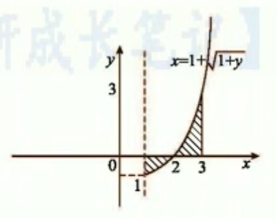
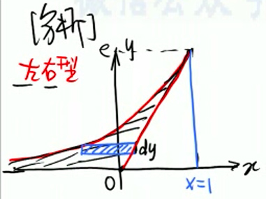

# 一、定义

 

## ㊀、不定积分【 +C 】

- $\forall x \in I$ ，使 $F'(x) = f(x)$ ，则称 $F(x)$ 是 $f(x)$ 在 $I$ 上的一个原函数。

- 全体原函数就叫不定积分，记成：$\int f(x) \, {\rm d}x  = F(x) + C$ 。

 

## ㊁、定积分

黎曼积分 

$$
\int_a^b f(x) \, {\rm d}x 
$$

 

## ㊂、小结

牛顿—莱布尼茨公式

$$
\left. \int_a^b f(x) \, {\rm d}x = F(x) \right|_{x = a}^{x = b} = F(b) - F(a)
$$

 

# 二、计算

 

## ㊀、凑微分法

 

### 1、基本积分公式

- $\int x^k {\rm d}x = \dfrac{1}{k + 1}x^{k + 1} + C, \quad ( k \not= -1 )$ 
   - $\begin{cases} \int \dfrac{1}{x^2} \, {\rm d}x = -\dfrac{1}{x} + C \\\\ \int \dfrac{1}{ \sqrt{x} } \, {\rm d}x = 2 \sqrt{x} + C \end{cases}$ 
      
      - $\dfrac{ {\rm d}u }{ \sqrt{u} } = {\rm d}( 2 \sqrt{u} )$

- $\int \dfrac{1}{x} \, {\rm d}x = \ln |x| + C$ 

- $\begin{cases} \int a^x \, {\rm d}x = \dfrac{1}{ \ln a } a^x + C, \quad ( a > 0, a \not= 1 ) \\\\ \int e^x \, {\rm d}x = e^x + C \end{cases}$ 

- $\begin{cases} \int \sin x \, {\rm d}x = - \cos x + C \quad & \int \tan x{\rm d}x = - \ln | \cos x | + C \\ \\ \int \cos x \, {\rm d}x = \sin x + C \quad & \int \cot x \, {\rm d}x = \ln | \sin x | + C \\ \\ \int \sec x \, {\rm d}x = \ln | \sec x + \tan x | + C \\\\ \int \csc x \, {\rm d}x = \ln | \csc x - \cot x | + C \\\\ \int \sec^2 x \, {\rm d}x = \tan x + C \quad & \int \sec x \tan x \, {\rm d}x = \sec x + C \\\\ \int \csc^2 x \, {\rm d}x = - \cot x + C \quad & \int \csc x \cot x \, {\rm d}x = - \csc x + C \end{cases}$ 

- $\begin{cases} \int \dfrac{1}{ \sqrt{1 - x^2} }{\rm d}x = \arcsin x + C \quad & \int \dfrac{1}{ \sqrt{x^2 + a^2} } = \ln ( x + \sqrt{x^2 + a^2} ) + C \\\\ \int \dfrac{1}{ \sqrt{a^2 - x^2} }{\rm d}x = \arcsin \dfrac{x}{a} + C \quad & \int \dfrac{1}{ \sqrt{x^2 - a^2} } = \ln ( x + \sqrt{x^2 - a^2} ) + C \\\\ \int \dfrac{1}{1 + x^2}{\rm d}x = \arctan x + C \quad & \int \dfrac{1}{a^2 - x^2} \, {\rm d}x = \dfrac{1}{2a} \ln |\dfrac{a + x}{a - x}| + C \\\\   \int \dfrac{1}{a^2 + x^2}{\rm d}x = \dfrac{1}{a} \arctan \dfrac{x}{a} + C \quad & \int \dfrac{1}{x^2 - a^2} \, {\rm d}x = \dfrac{1}{2a} \ln |\dfrac{x - a}{x + a}| + C \end{cases}$

- $\int \sqrt{a^2 - x^2} \, {\rm d}x = \dfrac{a^2}{2} \arcsin \dfrac{x}{a} + \dfrac{x}{2} \sqrt{a^2 - x^2} + C$ 

 

### 2、例题

1. $\int \dfrac{1}{ (2 - x) \sqrt{1 - x} } \, {\rm d}x$ 
   
   - $= - \int \dfrac{1}{2 - x} \cdot \dfrac{ {\rm d}(1 - x) }{ \sqrt{1 - x} } = -2 \int \dfrac{ {\rm d} \sqrt{1 - x} }{ 2 - x }$ 
   
   - $= -2 \int \dfrac{ {\rm d} \sqrt{1 - x} }{ 1 + ( \sqrt{1 - x} )^2 } = -2 \arctan \sqrt{1 - x} + C$ 

2. $\int \dfrac{x}{ (2 - x^2) \sqrt{1 - x^2} } \, {\rm d}x$ 

3. $\int \dfrac{ \cos^2 x - \sin x }{ \cos x(1 + \cos x e^{\sin x}) } \, {\rm d}x$ 
   
   - **定理** 
     
      - 对于 $\int f(x) \, {\rm d}x$ ，$f(x)$ 越复杂 $\implies$ 越有规律可循。
     
      1. 先对**复杂的主要部分( h(x) )**求导
        
         - $\int f(x) \, {\rm d}x = \int g(x) \cdot h(x) {\rm d}x$ 
           
            - 其中，若 $ h'(x) = A \cdot g(x) \implies {\rm d} h(x) = A \cdot g(x) {\rm d}x$ 
     
      2. 凑微分 
         
         - $\int f(x) \, {\rm d}x = \dfrac{1}{A} \int h(x) \cdot A \cdot g(x) {\rm d}x = \dfrac{1}{A} \int h(x) {\rm d} h(x)$ 
   
   - 解答
      
      1. $(\cos x e^{\sin x})' = - \sin x e^{\sin x} + \cos^2 x e^{\sin x} = e^{\sin x}( \cos^2 x - \sin x )$ 
         
         - $\begin{array}{l} I & = \int \dfrac{ e^{\sin x}( \cos^2 x - \sin x ) {\rm d}x }{ e^{\sin x} \cos x( 1 + \cos x e^{\sin x} ) } \\\\ & = \int \dfrac{ {\rm d}( \cos x e^{\sin x} ) }{ \cos x e^{\sin x}( 1 + \cos x e^{\sin x} ) } \quad \quad \left( \dfrac{ {\rm d}u }{ u(1 + u) } \right) \\\\ & = \ln \left| \dfrac{ \cos x e^{\sin x} }{ 1 + \cos x e^{\sin x} } \right| + C \end{array}$ 

4. 求 $\int \dfrac{1 - \ln x}{ (x - \ln x)^2 } \, {\rm d}x$ 
   
   - 分析
     
      - $\left( \dfrac{x - \ln x}{x} \right)' = - \dfrac{1 - \ln x}{x^2}$ 
   
   - 解答
     
      - $\begin{array}{l} I = \int \dfrac{ \dfrac{1 - \ln x}{x^2} }{ \left( \dfrac{x - \ln x}{x} \right)^2 } \, {\rm d}x = - \int \dfrac{ {\rm d} \dfrac{x - \ln x}{x} }{ \left( \dfrac{x - \ln x}{x} \right)^2 } = \dfrac{x}{x - \ln x} + C \end{array}$ 

 

## ㊁、换元法

当凑微分法不成功时，考虑换元。

 

### 1、三角换元

- 方法
   
   - 当被积函数 $f(x)$ 含有 $\sqrt{a^2 - x^2}$ ，$\sqrt{a^2 + x^2}$ ，$\sqrt{x^2 - a^2} \quad (a > 0)$ 可作如下换元：
   
   - $\sqrt{a^2 - x^2} \implies$ 令 $x = a \sin t, \quad ( -\dfrac{\pi}{2} < t < \dfrac{\pi}{2} )$ 
     
      - 单调函数 有 反函数（保单调，可回代）
   
   - $\sqrt{a^2 + x^2} \implies$ 令 $x = a \tan t, \quad ( -\dfrac{\pi}{2} < t < \dfrac{\pi}{2} )$ 
   
   - $\sqrt{x^2 - a^2} \implies$ 令 $x = a \sec t, \quad \begin{cases} x > a,  0 \leq t < \dfrac{\pi}{2} \\\\ x < -a, \dfrac{\pi}{2} < t \leq \pi \end{cases}$ 
   
   - 若见到 $\sqrt{ax^2 + bx + c}$ ，要先化为 $\sqrt{ \varphi^2(x) - k^2 }$ ，$\sqrt{ k^2 - \varphi^2(x) }$ ，$\sqrt{ \varphi^2(x) + k^2 }$ ，再做三角换元。
 
 - 例题
   
   1. 求 $\int \dfrac{ {\rm d}x }{x + \sqrt{1 - x^2}}$ 
      
      - 令 $x = \sin t, t \in \left( \dfrac{\pi}{2}, \dfrac{\pi}{2} \right)$ 
      
      - $I = \dfrac{ \cos t }{ \sin t + \cos t } {\rm d}t = \dfrac{1}{2} \int \dfrac{ \sin t + \cos t + \cos t - \sin t }{ \sin t + \cos t } {\rm d}t$ 
      
      - $I = \dfrac{1}{2} \left( \int 1 {\rm d}t + \int \dfrac{ {\rm d} ( \sin t + \cos t ) }{ \sin t + \cos t } \right) = \dfrac{1}{2} \left( t + \ln | \sin t + \cos t | \right)$ 
      
      - $I = \dfrac{1}{2} \arcsin x + \dfrac{1}{2} \ln | x + \sqrt{1 - x^2} | + C$ 
   
   - ⭐️【注】⭐️
     
      - $\begin{array}{l} \int \dfrac{ a_2 \sin t + b_2 \cos t }{ a_1 \sin t + b_1 \cos t } {\rm d}t & = \int \dfrac{ A ( a_1 \sin t + b_1 \cos t ) + B ( a_1 \cos t - b_1 \sin t ) }{ a_1 \sin t + b_1 \cos t } {\rm d}t \\\\ & = At + B \ln| a_1 \sin t + b_1 \cos t | + C  \end{array}$ 
     
      - 其中 $\begin{cases} Aa_1 - Bb_1 = a_2 \\\\ Ab_1 + Ba_1 = b_2 \end{cases}$ 

 

### 2、倒带换

$(x = \dfrac{1}{t})$

- 可用于分子次数明显低于分母次数时。

- 方法
   
   - $\left. \begin{array}{l} \int \dfrac{1}{ x^k \sqrt{ a^2 - x^2 } } \, {\rm d}x \\\\ \int \dfrac{1}{ x^k \sqrt{ a^2 + x^2 } } \, {\rm d}x \\\\ \int \dfrac{1}{ x^k \sqrt{ x^2 - a^2 } } \, {\rm d}x \end{array} \right\} \quad k = 1, 2, 4$ 

 

### 3、复杂部分代换

- 令复杂部分 $= t$（举重若轻）

- 方法
   
   - $\sqrt[n]{ax + b} = t$ ， $\sqrt{ \dfrac{ax + b}{cx + d} } = t$ ， $\sqrt{ ae^{bx} + c } = t$ （根式代换）
   
   - $a^x, \, e^x = t$（指数代换）
   
   - $\ln x = t$（对数代换）
   
   - $\arcsin x, \, \arctan x = t$（反三角函数代换）$\cdots$ 

- 例题
   
   1. 求 $I = \int \sqrt{ \dfrac{1 - x}{1 + x} } \cdot \dfrac{ {\rm d}x }{x}$ 。
     
      - 解 ㊀
         
         - 令 $\sqrt{ \dfrac{1 - x}{1 + x} } = t, \quad x = \dfrac{1 - t^2}{1 + t^2}$ 
         
         - 所以： $\begin{array}{l} I & = \int t \cdot \dfrac{1 + t^2}{1 - t^2} \cdot \dfrac{-4t}{ (1 + t^2)^2 } {\rm d}t \\\\ & = -4 \int \dfrac{t^2}{ (1 - t^2)(1 + t^2) } {\rm d}t \\\\ & = 2 \int \left( \dfrac{1}{1 + t^2} - \dfrac{1}{1 - t^2} \right) {\rm d}t \\\\ & = 2 \arctan t - \ln \left| \dfrac{1 + t}{1 - t} \right| + C \end{array}$
         
         - **回代**：$I = 2 \arctan \sqrt{ \dfrac{1 - x}{1 + x} } - \ln \left| \dfrac{ \sqrt{1 + x} + \sqrt{1 - x} }{ \sqrt{1 + x} - \sqrt{1 - x} } \right| + C$ 
     
      - 解 ㊁
         
         - $I = \int \sqrt{ \dfrac{1 - x}{1 + x} } \cdot \dfrac{ {\rm d}x }{x} = \int \dfrac{ \sqrt{1 - x^2} }{(1 + x)x} \, {\rm d}x$ 
         
         - 令 $s = \sin t, t \in \left( -\dfrac{\pi}{2}, \dfrac{\pi}{2} \right)$ 
         
         - $\begin{array}{l} I & = \int \dfrac{ \cos^2 t }{ (1 + \sin t) \sin t } {\rm d}t \\\\ & = \int \dfrac{ (1 + \sin t)(1 - \sin t) }{ (1 + \sin t) \sin t } {\rm d}t \\\\ & = \int \csc t \, {\rm d}t - \int 1 {\rm d}t \\\\ & = \ln| \csc t - \cot t | - t + C \end{array}$ 
         
         - 回代：$I = \ln \left| \dfrac{1}{x} - \dfrac{ \sqrt{1 - x^2} }{x} \right| - \arcsin x + C$ 

 

## ㊂、分部积分法

$\underrightarrow{ \text{反、对、幂、指、三} } \implies \underrightarrow{ \text{更容易求导} \to \text{更容易积分} } \implies \int u {\rm d}v = uv - \int v {\rm d}u$  

此方法一般是在运算过程中：$\begin{cases} 1. & \text{出现了不同类型函数的乘积} \\\\ 2. & \text{且求} \int u \, {\rm d}v \text{ 困难}，而求 \int v \, {\rm d}u \text{ 简单时} \end{cases}$ 

 

### 1、⭐️方法

1. 被积函数为 $P_n(x) \cdot e^{kx}$ ，$P_n(x) \sin ax$ ，$P_n(x) \cos ax$ ，选 $P_n(x) = u$ ，其中 $P_n(x)$ 为幂函数多项式。
   
   - $u$ 求导至 $0$ 。

2. 被积函数为 $e^{ax} \sin bx$ ，$e^{ax} \cos bx$ ，选谁当 $u$ 都行。

   - $u$ 求导两次。 

3. 被积函数为 $P_n(x) \ln x$ ，$P_n(x) \arcsin x$ ，$P_n(x) \arctan x$ ，选 $\ln x，\, \text{arc-} = u$ 。

   - $u$ 求导一次。 

- 【注】分部积分公式的推广为：

   - $\int uv^{(n + 1)} \, {\rm d}x = uv^{(n)} - u'v^{(n - 1)} + u''v^{(n - 2)} - \cdots + (-1)^n u^{(n)}v + (-1)^{n + 1} \int u^{(n + 1)}v \, {\rm d}x$ 

   - 对 $u$ 求导，对 $v^{(n + 1)}$ 积分

   - 交错相乘、正负相间、首项为正

   - 最后一项（列）相乘再积分

   - 

$$
\begin{array}{|c|c|c|c|c|c|}
  \hline \\
  u & u' & u'' & \cdots & u^{(n)} & u^{(n + 1)} \\\\
  \hline \\
  v^{(n + 1)} & v^{(n)} & v^{(n - 1)} & \cdots & \cdots & v \\\\
  \hline
\end{array} 
$$

 

### 2、例题

1. 求 $\int x^2 \arctan x \, {\rm d}x$ 
   
   - $= \dfrac{1}{3}x^3 \arctan x - \dfrac{1}{6} x^2 - \dfrac{1}{6} \ln (1 + x^2) + C$ 

2. 求 $\int e^{2x} \sin 3x \, {\rm d}x$ 
   
   - $= -\dfrac{3}{13} e^{2x} \cos 3x + \dfrac{2}{13} e^{2x} \sin 3x + C$ 

3. 设 $f( \ln x ) = \dfrac{ \ln (1 + x) }{x}$ ，计算 $\int f(x) \, {\rm d}x$ 。
   
   - 令 $\ln x = t, \quad t = e^t \implies f(t) = \dfrac{ \ln(1 + e^t) }{e^t}$ 
   
   - $\begin{array}{l} \int f(x) \, {\rm d}x & = \int \ln (1 + e^x) \cdot e^{-x} \, {\rm d}x \\\\ & = - e^{-x} \ln(1 + e^x) + \int \dfrac{1 + e^x - e^x}{1 + e^x} \, {\rm d}x \\\\ & = - e^{-x} \ln(1 + e^x) + x - \ln(1 + e^x) + C \\\\ & = x - ( e^{-x} + 1 )\ln (1 + e^x) + C \end{array}$ 

 

## ㊃、有理函数积分

 

### 1、定义

- 形如 $\int \dfrac{ P_n(x) }{ Q_m(x) } \, {\rm d}x, \quad (n < m)$ 的积分。 

 

### 2、方法

1. 将 $Q_m(x)$ 因式分解

2. 将 $\dfrac{ P_n(x) }{ Q_m(x) }$ 拆成若干最简有理公式之和

 

### 3、拆分原则

1. $Q_m(x)$ 分解出 $(ax + b)^k \implies$ 产生 $ k $ 项。
   
   - $\dfrac{A_1}{ ax + b } + \dfrac{A_2}{ (ax + b)^2 } + \cdots + \dfrac{A_k}{ (ax + b)^k }, \quad k = 1, 2, \ldots$ 

2. $Q_m(x)$ 分解出 $(px^2 + qx + r)^k \implies$ 产生 $k$ 项。
   
   - $\dfrac{ A_1x + B_1 }{ px^2 + qx +r } + \dfrac{ A_2x + B }{ (px^2 + qx + r)^2 } + \cdots + \dfrac{ A_kx + B_k }{ (px^2 + qx + r)^k }, \quad k = 1, 2, \ldots$ 

 

### 4、例题

1. 计算 $I = \int \dfrac{ 4x^2 - 6x -1 }{ (x + 1)(2x - 1)^2 } \, {\rm d}x$ 。
   
   - $\dfrac{ 4x^2 - 6x -1 }{ (x + 1)(2x - 1)^2 } = \dfrac{1}{x + 1} - \dfrac{2}{ (2x - 1)^2 }$ 
    
      - $4x^2 - 6x -1 = A(2x - 1)^2 + B(x - 1)(2x - 1) + C(x + 1)$ 
    
         - $\begin{cases} \text{ 取 } x = \dfrac{1}{2}, \quad -3 = C( \dfrac{1}{2} + 1 ) & \implies C = -2 \\\\ \text{ 取 } x = -1, \quad 9 = 9A & \implies A = 1 \\\\ \text{ 比较 } x^2 \text{ 的系数}, \quad 4 = 4A + 2B & \implies B = 0 \end{cases}$ 
   
   - $\begin{array}{l} I &= \int \dfrac{1}{x + 1} \, {\rm d}x - 2 \int \dfrac{1}{ (2x - 1)^2 } \, {\rm d}x \\\\ &= \ln |x + 1| + \dfrac{1}{2x - 1} + C \\ \end{array}$ 

2. 计算 $I = \int \dfrac{x}{x^3 - x^2 + x - 1} \, {\rm d}x$ 
   
   - $I = \int \dfrac{x}{ (x^2 + 1)(x - 1) } \, {\rm d}x$ 
   
   - $\dfrac{x}{ (x^2 + 1)(x - 1) } = \dfrac{1}{2} \left( \dfrac{-x + 1}{x^2 + 1} + \dfrac{1}{x - 1} \right)$ 
   
   - $\begin{array}{l} I & = -\dfrac{1}{2} \int \left( \dfrac{ \frac{1}{2} \cdot 2x - 1 }{ x^2 + 1 } \right) {\rm d}x + \dfrac{1}{2} \int \dfrac{1}{x - 1} \, {\rm d}x \\\\ & = -\dfrac{1}{4} \ln(x^2 + 1) + \dfrac{1}{2} \arctan x + \dfrac{1}{2} \ln |x - 1| + C \end{array}$ 

3. 计算 $I = \int \dfrac{t^3 - 3t}{ (t - 1)^2(t + 1)^2 } {\rm d}t$
      
   - $\dfrac{t^3 - 3t}{ (t - 1)^2(t + 1)^2 } = \dfrac{1}{2} \left[ \dfrac{ 1 }{t - 1} + \dfrac{ -1 }{ (t - 1)^2 } + \dfrac{ 1 }{t + 1} + \dfrac{ 1 }{ (t + 1)^2 } \right]$ 
      
   - $\begin{array}{l} \\ I & = \dfrac{1}{2} \left( \ln \mid t - 1 \mid + \dfrac{1}{t - 1} + \ln \mid t + 1 \mid - \dfrac{1}{t + 1} \right) + C \\\\ & = \dfrac{1}{2} \ln \mid t^2 - 1 \mid + \dfrac{1}{t^2 - 1} + C \\ & \end{array}$ 

 

# 三、定积分的计算

 

##  ㊀、定义

$$
\int_a^b f(x) \, {\rm d}x = F(b) - F(a)
$$

若 $a$ 或 $b$ 不存在，则计算其极限。 

 

##  ㊁、例题

1. $I = \int_1^4 \dfrac{1}{ 1 + \sqrt{x} } \, {\rm d}x$ 
   
   - $\begin{array}{l} I &= \int_1^2 \dfrac{2t}{1+t} {\rm d}t \\\\      &= \int_1^2 \left( 2 - \dfrac{2}{1+t} \right) {\rm d}t \\\\       &= 2( 1 - \ln 3 + \ln 2 ) \end{array}$ 

2. ⭐️ $I_n = \int_0^{\pi/2} \sin^n x \, {\rm d}x$，$n$ 为大于 $1$ 的整数。
   
   - 正弦曲线一股的面积是 $2$，半股的面积是 $1$。
     
      - $\int_0^{\pi/2} \sin x \, {\rm d}x = 1$ 
   
   - 证 $\int_0^{\pi/2} \sin^n x \, {\rm d}x = \int_0^{\pi/2} \cos^n x \, {\rm d}x$ 。
     
      - 令 $x = \dfrac{\pi}{2} - t$ 
     
      - $\int_0^{\pi/2} \sin^n x \, {\rm d}x = \int_{ \pi / 2 }^0 \sin^n (\dfrac{\pi}{2} - t) \, {\rm d}(-t) = \int_0^{\pi/2} \cos^n x \, {\rm d}x$ 
   
   - 方法
     
      - $n > 1$ 时
       
         - $\begin{array}{l} I_n & = \int_0^{\pi/2} \sin^{n - 1} x \cdot \sin x \, {\rm d}x = - \int_0^{\pi/2} \sin^{n - 1} x {\rm d} \cos x \\\\      & = \left. - \sin^{n - 1} x \cos x \right|_0^{ \frac{\pi}{2} } + \int_0^{\pi/2} \cos x \cdot (n - 1) \cdot \sin^{n - 2}x \cdot \cos x \, {\rm d}x \\\\      & = (n - 1) \int_0^{\pi/2} (1 - \sin^2 x) \sin^{n - 2} x \, {\rm d}x \\\\      & = (n - 1) \int_0^{\pi/2} \sin^{n - 2} x \, {\rm d}x - (n - 1) \int_0^{\pi/2} \sin^n x \, {\rm d}x \\\\      & = (n - 1) I_{n - 2} - (n - 1) I_n \end{array}$ 
       
         - $\begin{array}{l} \\ \implies I_n = \dfrac{n - 1}{n} I_{n - 2}, \quad n = 2, 3, \ldots \\ & \end{array}$ 
       
         - ⭐️ $I_n = \begin{cases} \dfrac{n - 1}{n} \cdot \dfrac{n - 2}{n - 3} \cdots \dfrac{1}{2} \cdot \dfrac{\pi}{2}, \quad & n \text{ 为正偶数} \\\\ \dfrac{n - 1}{n} \cdot \dfrac{n - 2}{n - 3} \cdots \dfrac{2}{3} \cdot 1, \quad & n \text{ 为大于1的奇数} \end{cases}$ 
         
            - 华里士公式

3. $I = \int_{-1}^1 x^2 \sqrt{1 - x^2} \, {\rm d}x$ 

   - $I = 2 \int_0^1 x^2 \sqrt{1 - x^2} \, {\rm d}x$ 

   - 令 $x = \sin t$ 

      - $\begin{array}{l} I & = 2 \int_0^{\pi/2} \sin^2 t \cos t \cdot \cos t \, {\rm d}t \\\\ & = 2 \int_0^{\pi/2} \sin^2 t \, {\rm d}t - 2 \int_0^{\pi/2} \sin^4 t \, {\rm d}t \\\\ & = 2 \cdot \dfrac{1}{2} \cdot \dfrac{\pi}{2} - 2 \cdot \dfrac{3}{4} \cdot \dfrac{1}{2} \cdot \dfrac{\pi}{2} \\\\ & = \dfrac{\pi}{8} \end{array}$ 

4. 求 $I = \int_0^{2 \pi} \sin^n x \, {\rm d}x, \quad (n > 1)$ 

   - 预备定理

      - 若 $f(x)$ 以 $T$ 为周期，连续，则 

         - $\forall a$，$\int_0^T f(x) \, {\rm d}x = \int_a^{a + T} f(x) \, {\rm d}x$ 

      - 证明

         - $\int_a^{a + T} f(x) \, {\rm d}x = \int_a^0 f(x) \, {\rm d}x + \int_0^T f(x) \, {\rm d}x + \int_T^{a + T} f(x) \, {\rm d}x$ 

         - 令 $x - T = u$ 

            - $\int_T^{a + T} f(x) \, {\rm d}x = \int_0^a f(u + T) {\rm d}u = \int_0^a f(u) {\rm d}u = - \int_a^0 f(x) \, {\rm d}x$ 

         - 所以 $\int_0^T f(x) \, {\rm d}x = \int_a^{a + T} f(x) \, {\rm d}x$ 。

      - 延伸

         - $f(x)$ 是奇函数，$T$ 为周期，连续，则：

         - $\int_0^T f(x) \, {\rm d}x = \int_{ -\frac{\pi}{2} }^{ \frac{\pi}{2} } f(x) \, {\rm d}x = 0$ 

   - 计算

      - $I = \int_{-\pi}^{\pi} \sin^n x \, {\rm d}x = \begin{cases} 0, & n \text{ 为奇数} \\\\ 2 \int_0^{\pi} \sin^n x \, {\rm d}x, & n \text{ 为偶数} \end{cases}$ 

      - 其中 $\int_0^{\pi} \sin^n x \, {\rm d}x = \int_0^{\pi/2} \sin^n x \, {\rm d}x + \int_{\pi/2}^{\pi} \sin^n x \, {\rm d}x$ 

         - 令 $t = {\pi} - x$ ，$\int_{ \frac{\pi}{2} }^{\pi} \sin^n x \, {\rm d}x = \int_{ \frac{\pi}{2} }^0 \sin^n ( {\pi} - t )( - {\rm d}t ) = \int_0^{\pi/2} \sin^n t \, {\rm d}t$ 

      - ⭐️ $\int_{0}^{2 \pi} \cos^n x \, {\rm d}x = \int_{0}^{2 \pi} \sin^n x \, {\rm d}x = \begin{cases} 0, & n \text{ 为奇数} \\ 4 \int_0^{\pi/2} \sin^n x \, {\rm d}x, & n \text{ 为偶数} \end{cases}$ 

5. 计算 $I = \int_0^6 x^2 \sqrt{6x - x^2} \, {\rm d}x$ 。

   - 令 $x = 3 + 3 \sin t$ 

   - $I = \dfrac{405}{8} \pi$ 

 

# 四、一元函数积分学的应用

 

## ㊀、用积分表达和计算平面图形的面积

 

### 1、概念

- $y = y_1(x), \, y = y_2(x), \, x = a, \, x = b, \, (a < b)$ 所围成的平面图形的面积。

- $S = \int_a^b \left| y_2(x) - y_1(x) \right| {\rm d}x$ 

 

### 2、例题

1. 设函数 $f(x)$ 在 $[0, 1]$ 上连续，在 $(0, 1)$ 内大于零，并且满足 $xf'(x) = f(x) + \dfrac{3a}{2} x^2, (a \text{ 为常数})$ ，又曲线 $y = f(x)$ 与 $x = 1, y = 0$ 所围的图形 $S$ 的面积为 $2$ 。1️⃣求函数 $y = f(x)$ 。2️⃣ $a$ 为何值时，图形 $S$ 绕 $x$ 轴旋转一周所得的旋转体的体积最小。
   
   - 1️⃣
    
      - $x \not= 0$ 时，$\left( \dfrac{ f(x) }{x} \right)' = \dfrac{ xf'(x) - f(x) }{x^2} = \dfrac{3a}{2} \\\\ \implies \dfrac{ f(x) }{x} = \dfrac{3a}{2} x + C \\\\ \implies f(x) = \dfrac{3a}{2} x^2 + Cx, \quad x \in [0, 1]$ 
     
      - 又 $ S = 2 = \int_0^1 \left[ \left( \dfrac{3a}{2} x^2 + Cx \right) - 0 \right] {\rm d}x = \dfrac{a}{2} + \dfrac{C}{2} \\\\ \implies C = 4 - a \\\\ \implies f(x) = \dfrac{3a}{2} x^2 + (4 - a)x$ 

 

## ㊁、用积分表达和计算旋转体的体积

 

### 1、概念

- $y = y(x)$ 与 $x = a, x = b, (a < b)$ 及 $x$ 轴所围图形绕 $x$ 轴旋转一周所得的旋转体体积。
   
   - 
   
   - $V_x = \int_a^b \pi f^2(x) {\rm d}x$ 

- $y = y(x)$ 与 $x = a, x = b, (a < b)$ 及 $x$ 轴所围图形绕 $y $ 轴旋转一周所得的旋转体体积。
   
   -  
   
   - $V_y = \int_a^b 2 \pi x | f(x) | {\rm d}x$
     
      - 柱壳法 

 

### 2、例题

1. 设函数 $f(x)$ 在 $[0, 1]$ 上连续，在 $(0, 1)$ 内大于零，并且满足 $xf'(x) = f(x) + \dfrac{3a}{2} x^2, (a \text{ 为常数})$ ，又曲线 $y = f(x)$ 与 $x = 1, y = 0$ 所围的图形 $ S$ 的面积为 $ 2 $ 。1️⃣ 求函数 $y = f(x)$ 。2️⃣ $a $ 为何值时，图形 $ S$ 绕 $x$ 轴旋转一周所得的旋转体的体积最小。
   
   - 1️⃣ 
    
      - $f(x) = \dfrac{3a}{2} x^2 + (4 - a)x$ 
   
   - 2️⃣ 
    
      - $\begin{array}{l} V & = \int_0^1 \pi f^2(x) {\rm d}x \\\\ & = \pi \left( \dfrac{9}{4}a^2 \cdot \dfrac{1}{5} + 3a(4 - a) \cdot \dfrac{1}{4} + (4 - a)^2 \cdot \dfrac{1}{3} \right) \\\\ & = \left( \dfrac{1}{30} a^2 + \dfrac{1}{3} a + \dfrac{16}{3} \right) \pi  \end{array}$ 
    
      - $V_a' = \left( \dfrac{1}{15} a + \dfrac{1}{3} \right) \pi = 0 \implies a = -5$ 
     
      - 且 $V_a'' = \dfrac{1}{15} \pi > 0$ ，所以 $a = -5 $ 时 $V_{min} = \dfrac{9}{2} \pi$ 

2. 设平面图形 $\sigma$ 由 $y = x^2 - 2x, y = 0, x = 1, x = 3$ 围成，求 $\sigma$ 绕 $y$ 轴旋转一周所得的旋转体体积。
   
   -  
   
   - $\begin{array}{l} V & = \int_1^3 2 \pi x | f(x) | {\rm d}x \\\\ & = 2 \pi \left[ -\int_1^2 x(x^2 - 2x) {\rm d}x - \int_2^3 x(x^2 - 2x) {\rm d}x \right] \\\\ & = 9 \pi \end{array}$ 

3. 过原点作 $y = e^x$ 的切线，该切线与 $y = e^x$、$x$ 轴所围成的向 $x$ 轴负向无限伸展的平面图形记为 $D$ ，1️⃣ 求 $D$ 的面积 $S$ ，2️⃣ $D$ 绕 $x = 1$ 旋转一周的旋转体的体积 $V$ 。
   
   - 
   
   - 1️⃣ 
     
      - 设切点 $( x_0, e^{x_0} )$，所以 $ k = y'(x_0) = e^{x_0}$ 
       
         - 切线方程为 $y - e^{x_0} = e^{x_0} (x - x_0)$ ，过原点，$\implies x_0 = 1$ 
       
         - $\implies$ 切线方程 $y = ex$ 
     
      - $\begin{array}{l} S & = \int_{-\infty}^0 e^x \, {\rm d}x + \int_0^1 ( e^x - ex ) {\rm d}x = \int_0^e ( \dfrac{y}{e} - \ln y ) {\rm d}y \\\\ & = \left. \dfrac{y^2}{2e} \right|_0^e - \left. y \ln y \right|_0^e + \left. y \right|_0^e = \dfrac{e}{2} + \lim\limits_{y \to 0^+} y \ln y \\\\ & = \dfrac{e}{2} \end{array}$ 
   
   - 2️⃣ 
     
      - $\begin{array}{l} V & = \int_0^e \pi (1 - \ln y)^2 {\rm d}y - \dfrac{\pi e}{3} \\\\ & = \int_0^e \pi ( 1 - 2 \ln y + \ln^2 y ) {\rm d} y - \dfrac{\pi e}{3} \\\\ & = \pi \left[ \left. y \right|_0^e - \left. 2( y \ln y - y ) \right|_0^e + \left. ( y \ln^2 y - 2y \ln y + 2y ) \right|_0^e \right] - \dfrac{\pi e}{3} \\\\ & = \dfrac{5 \pi}{3}e \end{array}$ 

 

## ㊂、用积分表达和计算函数的平均值

 

### 1、概念

- $y(x)$ 在 $[a, b]$ 上的平均值 $ave = \dfrac{ \int_a^b y(x) {\rm d}x }{b - a}$ 

 

### 2、例题

1. 函数 $y = \ln x$ 在区间 $[1, e]$ 上的平均值为 ________ 。
   
   - $ave = \dfrac{ \int_1^e \ln x \, {\rm d}x }{e - 1} = \dfrac{1}{e - 1}$ 

 

## ㊃、计算弧长

【转】<a href="http://math001.com/integral_arc/" target="_blank">积分求平面曲线的弧长</a>

 

### 1、参数方程

设曲线弧由参数方程

$$
\begin{cases}
  x = \varphi(t) \\\\
  y = \psi(t)
\end{cases} \qquad (\alpha \leq t \leq \beta)
$$

给出，其中 $\varphi(t), \, \psi(t) \text{ 在 } [\alpha, \beta]$ 上具有连续导数，t 为参变量，在 $[\alpha, \, \beta]$ 上任一小区间 $[t, \, t+{\rm d}t]$ 的小弧段长度 $\Delta s$ 近似等于弧长。

$$
\begin{array}{l}
  \Delta x = \varphi(t + {\rm d}t) - \varphi(t) \approx \, {\rm d}x = \varphi'(t) {\rm d}t \\\\
  \Delta y = \psi(t + {\rm d}t) - \psi(t) \approx \, {\rm d}x = \psi'(t) {\rm d}t
\end{array}
$$

$\Delta s$ 的近似值（弧微分）及弧长元素为

$$
\begin{array}{l}
  {\rm d}s &= \sqrt{ ({\rm d}x)^2 + ({\rm d}y)^2 } \\\\ 
  &= \sqrt{ \left( \varphi'(t){\rm d}t \right)^2 + \left( \psi'(t) \right)^2 } \\\\ 
  &= \sqrt{ \varphi'^2(t) + \psi'^2(t) } \, {\rm d}t
\end{array}
$$

弧长为

$$
s = \int_{\alpha}^{\beta} \sqrt{ \varphi'^2(t) + \psi'^2(t) } \, {\rm d}t
$$

 

### 2、直角坐标系

$y = f(x) \, (a \leq x \leq b)$ 使 x 为参变量，把函数写成参数方程

$$
\begin{cases}
  x = x \\\\
  y = f(x)
\end{cases} \qquad (a \leq x \leq b)
$$

则弧长

$$
s = \int_{a}^{b} \sqrt{ 1 + y'^2 } \, {\rm d}x
$$

 

### 3、极坐标

曲线弧由极坐标

$$
{\rm r} = {\rm r}(\theta) \qquad (\alpha \leq \theta \leq \beta)
$$

给出，${\rm r} (\theta) \text{ 在 } [\alpha, \, \beta]$ 上有连续导数，由直角坐标与极坐标的关系可得

$$
\begin{cases}
  x = {\rm r}(\theta) \cos \theta \\\\
  y = {\rm r}(\theta) \sin \theta
\end{cases} \qquad (\alpha \leq \theta \leq \beta)
$$

弧长为

$$
{\rm d}s = \sqrt{ x'^2(\theta) + y'^2(\theta) } \, {\rm d}\theta = \sqrt{ {\rm r}^2(\theta) + {\rm r}'^2(\theta) } \, {\rm d}\theta
$$

$$
s = \int_{\alpha}^{\beta} \sqrt{ {\rm r}^2(\theta) + {\rm r}'^2(\theta) } \, {\rm d}\theta
$$
